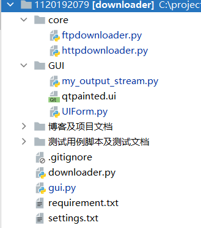
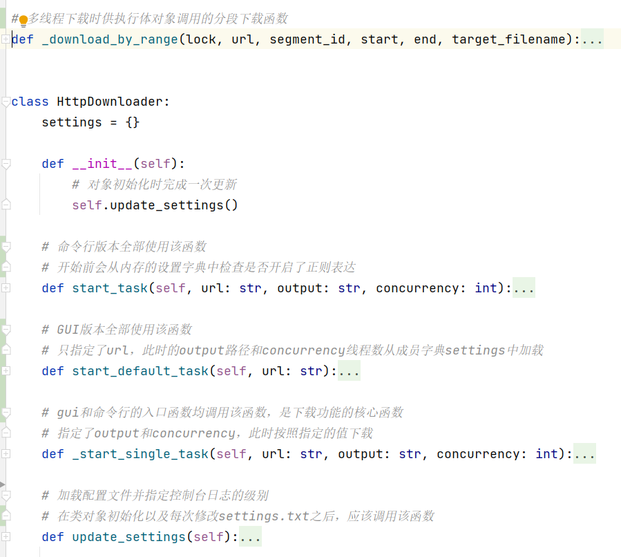
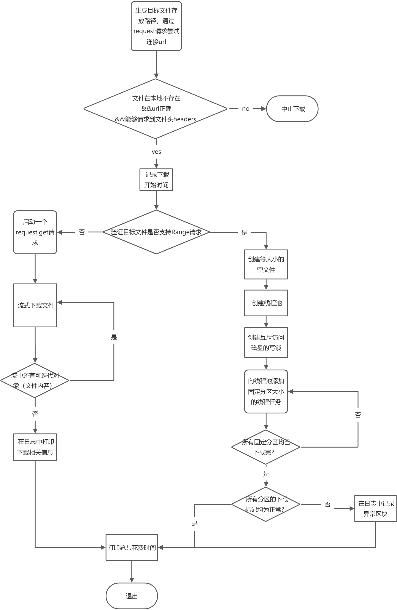
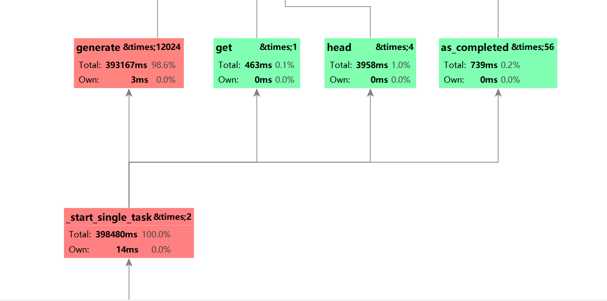
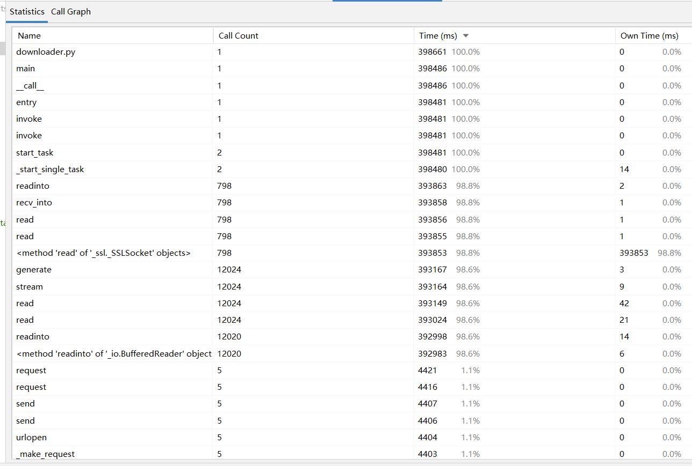
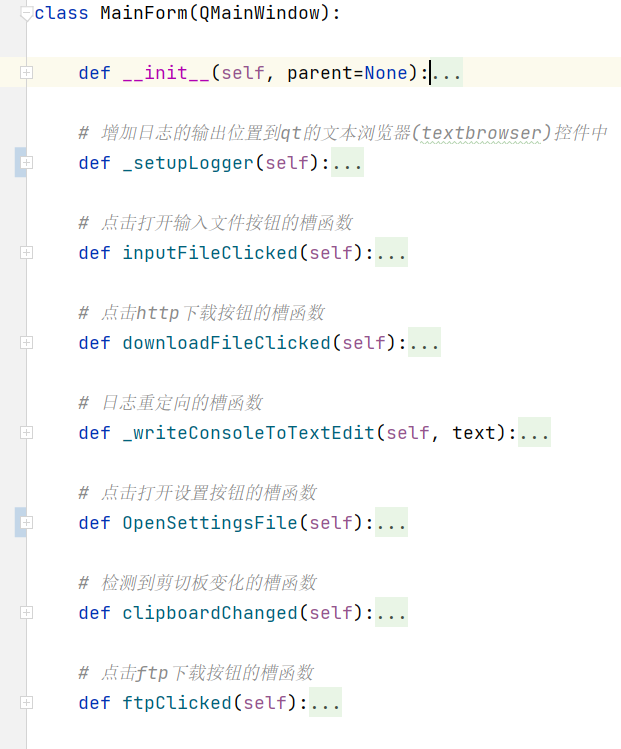

# 0. PSP表格

| PSP2.1                                  | Personal Software Process Stages        | 预估耗时（分钟） | 实际耗时（分钟） |
| --------------------------------------- | --------------------------------------- | ---------------- | ---------------- |
| **Planning**                            | **计划**                                | 20****           | **20**           |
| · Estimate                              | · 估计这个任务需要多少时间              | 20               | 20               |
| **Development**                         | **开发**                                | **1010**         | **1220**         |
| · Analysis                              | · 需求分析 (包括学习新技术)             | 300              | 600              |
| · Design Spec                           | · 生成设计文档                          | 30               | 60               |
| · Design Review                         | · 设计复审 (和同事审核设计文档)         | 30               | 10               |
| · Coding Standard                       | · 代码规范 (为目前的开发制定合适的规范) | 20               | 10               |
| · Design                                | · 具体设计                              | 180              | 60               |
| · Coding                                | · 具体编码                              | 120              | 300              |
| · Code Review                           | · 代码复审                              | 30               | 120              |
| · Test                                  | · 测试（自我测试，修改代码，提交修改）  | 300              | 120              |
| **Reporting**                           | **报告**                                | **90**           | **85**           |
| · Test Report                           | · 测试报告                              | 40               | 60               |
| · Size Measurement                      | · 计算工作量                            | 20               | 5                |
| · Postmortem & Process Improvement Plan | · 事后总结, 并提出过程改进计划          | 30               | 20               |
|                                         | **合计**                                | **1120**         | 1325             |

# 1. 解题思路描述

> 2022-1-9 20:51 ~ 23:30
>
> 解题思路描述。即刚开始拿到题目后，如何思考，如何找资料的过程。（3‘）

### 第一阶段思路

#### 需求分析

1. 单文件下载
2. 单文件分块多线程下载
3. 多文件下载
5. 使用参数指定
   1. 文件下载地址
   2. 并发线程数
   3. 文件存放地址

#### 解决方案

考虑到非过程化的功能较多，为了方便功能的快速开发，采用python作为开发语言

文件下载的核心功能由requests库中的get实现

多线程的分段下载，使用http请求头 Range 对文件进行分段下载，每个线程对应于文件的一个部分

参数指定是一个单独的模块，经过资料查阅，有两种解决方案

1. argsparser
2. click

由于python自带的argsparser功能较为单一，采用click包作为最终的模块选择

多线程涉及调试的问题，采用python自带的logging库进行基于日志的调试

多线程本身采用multithreading库实现，对于每一线程所下载的内容，还应该检查ETag（最近修改标志）

最后由于没有断点续传的需求，未添加ETAG和临时配置文件的机制


综上，需要学习或者观看项目文档的内容是，

1. requests库 ， get部分

2. click包的使用

3. http请求头中Range和Etag的作用（aborted）

4. 日志调试的基本技巧

5. python的多线程编程，multithreading库

   > 最后采用了python标准库中的concurrency.futures库，原因是因为该库封装了multithreading库，没有后者那么底层，使用简便
   >
   > [concurrent.futures --- 启动并行任务 — Python 3.10.2 文档](https://docs.python.org/zh-cn/3/library/concurrent.futures.html)


### 第二阶段思路

#### 需求分析:

在第一阶段的基础上，

* 需要增加额外的下载模块（ftp，bittorrent等）
* 同时还要支持多url，
  * 正则表达式形式的url，
  * 从文件读取url

#### 解决方案：

对于额外的下载模块：

在第一阶段的基础上，将http下载的核心函数封装成类，再另外书写了ftp下载的功能类

原本的downloader文件现在只起到根据任务创建相应下载对象分发任务的功能。


> 一个核心bug的解决思路：
>
> 对于ftp下载而言，需要额外获得用户名，密码，服务器上的文件地址等，这需要命令行的额外输入，在第一阶段完成的版本中，我的入口函数使用了click库提供的函数装饰器，导致函数内无法正常调用python标准库所提供的input函数，我猜测是因为经过click装饰的函数，无法直接和stdin进行交互而导致的错误
>
> 在查阅了click库的官方文档之后，发现click仅仅对单个字符的getchar操作有较好的支持。
>
> 翻阅了文档的其他示例发现，click有一个内置的方法可以直接读取标准输入流，从而跳过了click的上层封装getchar，得到了终端的原始输入，虽然得到的屏幕上显示的全部输入字符，但是经过一些处理，就可以形成我所希望的形式，
>
> 至此通过文档的查阅和自己的尝试，找到了一种可行的解决方案而没有太过深入底层不必要的细节


对于多url参数的指定：

click库已经提供了支持，此时接受的参数自动变为一个可迭代的对象，只需遍历所有内容，依次开始下载即可

对于文件读取的形式：

添加一个命令行参数，并尝试打开相应文件，并按行读入url，依次开始下载即可

对于正则表达式生成所有可能集合的支持：

查阅后发现exrex包能够支持对于一个给定的正则表达式，生成所有的匹配的串，若可生成的匹配字符串是无限的，则能够设定生成的数目，该库将会按照这个数量随机生成，这个包基本上能够满足需求了，

具体的语法请参阅：[asciimoo/exrex: Irregular methods on regular expressions (github.com)](https://github.com/asciimoo/exrex)下所给出的示例，注意网址中的 【.】以及【?】 需要使用转义符 【\】 修饰，否则在正则表达式中是通配符，会出现非预期的匹配结果


### 第三阶段思路

#### 需求分析

为下载器创建一个GUI，同时需要支持设置的持久化存储，还要支持剪切板的自动检测

#### 解决方案

经搜索后确定使用PyQt作为GUI界面的开发工具。

这对于第二阶段所完成的命令行版本的入口文件提出了分离核心下载功能成为独立文件/类的要求，因此对代码进行中等规模的重构，将

核心函数抽取封装成为两个类HttpDownloader 以及 FtpDownloader，所有的下载操作需要创建这两个对象

前端界面由于采用了Qt的框架，因此很轻松的实现了MVC框架：

```
MainForm是controller层，
分别有下载控制器和前端控件集合这两个子对象，下载的复杂逻辑下放到成员对象http_downloader以及ftp_downloader中
事件逻辑，持久化数据与前端控件实现了基于MVC模式的分离

UiForm是view层，Qt绘制的控件以及相应的属性设置置于这个部分

core.Downloaders是模型层，业务逻辑和数据持久存储由core包内的两个对象作为model来完成
```

同时由于第二阶段时，每次软件启动时设置项就是从txt文件中加载，因此持久化存储的工作只是在前端界面上添加更新设置的接口即可

# 2. 设计实现过程

> 设计包括代码如何组织，比如会有几个类，几个函数，他们之间关系如何，关键函数是否需要画出流程图？单元测试是怎么设计的？（5‘）


代码的组织结构为：



其中downloader.py和gui.py是程序的命令行和图形界面入口，分别可以独立运行，具体的使用方式见 `./运行说明.md`

### GUI程序部分

gui.py的主体是窗体的父对象MainForm，绘制了一张UML类图

.jpg)

gui.py实际上调用了core/目录下的httpdownloader以及ftpdownloader作为MainForm的子对象，

同时调用了GUI/目录下的Qt窗体布局文件来创建前端控件

以及GUI/目录下的my_output_stream作为自定义的输出流，用于改写控制台的日志输出位置到Qt控件内。

gui版本使用了MVC的架构模式：

MainForm是controller层，
分别有下载控制器和前端控件集合这两个子对象，下载的复杂逻辑下放到成员对象http_downloader以及ftp_downloader中
事件逻辑，持久化数据与前端控件实现了基于MVC模式的分离

同时，作为父窗体，MainForm内部有与来自UIForm的前端控件信号交互的槽函数，这是一个典型的Qt模式

UiForm是view层，Qt绘制的控件以及相应的属性设置置于这个部分

core.Downloaders是模型层，业务逻辑和数据持久存储由core包内的两个对象作为model来完成


### 核心函数：多线程下载

由于ftp下载较为简单，且多线程支持不好，因此ftpdownloader设计较为简单，仅有正常的下载与判错机制

这里着重写出httpdownloader.py中多线程下载函数的设计，文件的布局如下图所示



1. start_task作为命令行版本使用的函数，能够处理正则表达式，生成多个字符串，并交付给_start_single_task进行多线程下载

2. start_default_task作为gui版本使用的函数，每次下载会从成员字典中加载线程数和输出位置，gui调用时只需提供读取到的url，较为方便

3. 私有成员方法_start_single_task则是下载类关键的功能实现，它提供了多线程的下载支持，绘制函数流程图如下：



特别关注每个线程磁盘写锁的获取和线程池中线程任务的提交是同步进行的：

向线程池提交任务会返回future对象，异步的等待由concurrency.futures包中内置的函数实现

我设计的部分是每个线程执行的分段下载函数 _download_by_range()

函数签名如图：

```python
# 多线程下载时供执行体对象调用的分段下载函数
def _download_by_range(lock, url, segment_id, start, end, target_filename):
    """
    :param lock: 对磁盘的互斥读写锁
    :param url:文件链接
    :param segment_id:分段号
    :param start:开始字节
    :param end:结束字节
    :param target_filename:输出路径
    :return: {'cracked':bool [,'segment_id':int] }
    """
```

### 单元测试的设计

由上可见，由于入口的高度分离，单元测试变得非常容易，具体的单测设计见`./测试用例脚本及测试文档/测试说明文档.md`

# 3.程序性能与改进过程

> 记录在改进程序性能上所花费的时间，描述你改进的思路，并展示一张性能分析图（如使用Visual Studio的性能分析工具自动生成），并展示你程序中消耗最大的函数。（3‘）


使用cProfile工具对函数和各对象的运行时间进行性能分析与统计

执行测试的命令为

```shell
python "C:\Program Files\JetBrains\PyCharm 2021.2.2\plugins\python\helpers\profiler\run_profiler.py" 127.0.0.1 8206 downloader.py -i ./测试用例脚本及测试文档/inputfile.txt
```

下图是命令行版本的函数分析图的部分截取，完整部分可以见同目录下的`函数性能分析图.jpg`



下图也说明了核心函数就是_start_single_task,这个函数是最核心的调用



对该函数的几个调用进行分析：

head 是requests包的连接请求，在我的设计中，一次下载需要两次请求头，故两个下载任务请求了四次head，这个连接部分的请求用时较多，这里优化的部分是减少请求一次，可以减少约一倍的时间

get 是 requests包的取回内容请求，这里只发生一次是因为，在静态方法中调用的_download_by_range 不计入该函数的调用，否则会有50-60次左右的调用（多线程下载get请求多）

as_completed是线程完成后阻塞等待父进程下一步操作的方法，可以看到调用次数达到56次，50多次是因为图片的大小为55kb左右，而我设置的一次固定取回的区间长度为1kb，因此需要分56次向最大容量为8的线程池提交任务。

该函数花费的时间不多，不是优化的重点。

# 4.代码说明

> 展示出项目关键代码，并解释思路与注释说明。（3‘）

## 4.1 命令行程序

命令行程序的关键代码是httpdownloader的设计


其中的多线程下载函数_start_single_task的关键步骤

```python
start_time = time.time()
        # 多线程下载
        if r.status_code == 206:  # 支持range请求
            logging.info("MultiThread Supported! Concurrency:{} ".format(concurrency))
            # 由于 _download_by_range 中使用 rb+ 模式，必须先保证文件存在，所以要先创建指定大小的临时文件 (用0填充)
            mt_chunk_size = int(self.settings['chunk_size'])  # 加载多线程下载中所使用的分块大小
            with open(target_filename, 'wb') as fp:
                fp.seek(file_size - 1)
                fp.write(b'\0')

            # 注意with as 块在结束的时候会调用__exit__方法，而ThreadPoolExecutor的退出函数（.shutdown()）是等待所有的线程任务完成，隐含了一层同步的语义
            with futures.ThreadPoolExecutor(max_workers=concurrency) as executor:
                # 计算分块的数量
                tmp_part_count, tmp_mod = divmod(file_size, mt_chunk_size)
                segments = tmp_part_count if tmp_mod == 0 else int(tmp_part_count) + 1
                logging.debug("chunk_count %d Bytes, chunk_mod %d" % (tmp_part_count, tmp_mod))

                lock = threading.Lock()  # 创建互斥文件读写锁
                thread_queue = []  # 线程标记队列
                for segment_id in range(segments):
                    start_byte = segment_id * mt_chunk_size
                    end_byte = start_byte + mt_chunk_size - 1
                    # 注意若当前块为最后一块，则结束字节需要重新指定
                    if segment_id == segments - 1:
                        end_byte = file_size - 1
                    # 对每个线程调用_download_by_range函数，函数的返回值可以通过future对象的result方法得到
                    future = executor.submit(_download_by_range, lock, url, segment_id, start_byte, end_byte,
                                             target_filename)
                    thread_queue.append(future)

                # futures.as_completed([future set]) 返回已经完成任务的线程future
                completed_futures = futures.as_completed(thread_queue)
                with tqdm(
                        unit='B',  # 默认为位，改为字节作为默认单位
                        unit_divisor=1024,  # 将传输速率的单位改为存储字节的单位
                        unit_scale=True,  # 自动扩展单位
                        ascii=True,  # windows下正确显示需要指定显示模式为utf8
                        desc=os.path.basename(target_filename),  # 在进度条前方显示下载的文件名
                        total=file_size) as bar:
                    for future in completed_futures:
                        # result()方法指向回调函数的返回值
                        res = future.result()
                        if res.get("cracked"):
                            logging.error("part {} has cracked".format(res.get("segment_id")))
                        else:
                            bar.update(res.get('seg_size'))
```

分行注释的内容就是函数的关键思路，主要问题集中在，下载区间的划分，线程池任务提交，锁的创建和获取，所有线程异步下载之后的同步机制，以及每个区块函数给出下载的正确性的机制。

每个线程的执行函数_downloade_by_range的代码截取如下：

```python
# 多线程下载时供执行体对象调用的分段下载函数
def _download_by_range(lock, url, segment_id, start, end, target_filename):
    """
    :param lock: 对磁盘的互斥读写锁
    :param url:文件链接
    :param segment_id:分段号
    :param start:开始字节
    :param end:结束字节
    :param target_filename:输出路径
    :return: {'cracked':bool [,'segment_id':int] }
    """
    headers = {'Range': 'bytes=%d-%d' % (start, end)}
    r = requests.get(url=url, headers=headers)
    expected_segment_length = end - start + 1
    if not r or len(r.content) != expected_segment_length:
        logging.error("segment[%d]:bytes=%d-%d failed!" % (segment_id, start, end))
        return {'cracked': True}

    lock.acquire()  # 将内存中下载好的内容保存到磁盘中需要读写锁
    try:
        with open(target_filename, mode='rb+') as fp:
            fp.seek(start)  # 定位到起始字节
            fp.write(r.content)
    except Exception as e:
        logging.error("segment[{}]:bytes={}-{} failed!,Reason:{}".format(segment_id, start, end, e))
        return {
            'cracked': True,
            'segment_id': segment_id
        }
    finally:
        lock.release()

    logging.debug("segment[{}]:bytes={}-{} downloaded!".format(segment_id, start, end))
    return {
        'cracked': False,
        'segment_id': segment_id,
        'seg_size': expected_segment_length
    }
```

这里有两个tircks：

一个是申请锁之后才能访问文件，同时由于文件已经提前占位好最终大小的存储空间，只需根据开始的字节移动文件指针并写入即可

另一个是我设计的一个返回的结构体，通过返回键值对集合来提供强大的检查机制，在调用函数start_single_task中我只需要访问执行体的.result()方法就可以取回这些函数的返回值，进而能够判断每个线程的下载情况，定位出错位置

> 事实上，这里还能做出改进，就是对于下载失败的区块，二次提交到线程池，这样就能够实现一定的错误恢复能力


## 4.2 GUI程序

采用MVC设计模式，model层采用的是和命令行版本相同的下载函数，两者都调用了我编写的core包下的脚本，

view层采用QtDesigner绘制并直接生成代码，较为简单

下面附上controller层的部分函数



其中的难点在于日志文件的输出重定向，展示完整函数如下

```python
    def _setupLogger(self):
        """
        为此需要实现一个文件流式的对象，其中需要重写write方法。
        这里我的实现是在该文件流的write方法中发射一个信号，并由调用该文件流对象的MainForm中的函数槽来接收该信号
        这样就实现了基于logger输出流的handler的添加以及显示
        """

        logger = logging.getLogger()

        # 自己重写的类文件输出流中的信号挂钩到父窗体的内部方法，该内部方法能够修改qt的控件内容，从而实现了日志文件输出的重定向
        streamToTextbrowser = MyOutputStream(self._writeConsoleToTextEdit)

        # 用重写的输出流来初始化logger的一个新的handler
        handler = logging.StreamHandler(streamToTextbrowser)
        formatter = logging.Formatter(
            '[%(asctime)s] %(filename)s:%(lineno)s - [%(levelname)s] %(message)s')  # 规定输出格式
        handler.setFormatter(formatter)  # 将输出格式指定到handler上
        logger.addHandler(handler)

        logger.setLevel(level=self.http_downloader.settings.get('logging.level'))

        # 重定向输出
        # sys.stdout = EmittingConsole(text_signal=self.writeConsoleToTextEdit)
        # sys.stderr = EmittingConsole(text_signal=self.writeConsoleToTextEdit)
        return logger
```

重写的文件流对象MyOutputStream见下：

```python
class MyOutputStream(QtCore.QObject):
    text_signal = QtCore.pyqtSignal(str)

    def __init__(self, func):
        super().__init__()
        self.text_signal.connect(func)

    def write(self, text):
        self.text_signal.emit(str(text))

    def flush(self):
        pass
```

考虑到只需向控件传logger的输出，因此只需要实现write方法，我的实现思路是，在对象内部声明一个Qt的信号，write函数接受的输出直接通过信号量的方法发送给外界的槽函数，这样就实现了子对象和父对象其他子对象之间的通信，这是Qt信号与槽机制的比较经典的应用方法，

和标准库的logging一起重写输出流，并且成功得到重定向的输出，是我认为比较满意而且有一定难度的结果。


# 5. 开发日志

## 第一阶段

### 1月13日

1. 学习了python日志包的用法（logging module），将关键代码处添加了日志输出
2. 删去了with as结构，将try catch要完成的功能简化成日志的报错
3. 了解了存储单位（b-B-KB- e.t.c.）和传输速率单位（bit per second (bps) - 1Kbps（1Kb）- 1Mbps -e.t.c.）之间的进制区别 （1024 versus 1000），并且修改了下载进度条 tqdm组件的参数，使其满足存储单位以及对应的进制
4. 学习了python中可变参数列表 *args 以及 **kwargs的用法，他们分别对应一个列表和一个指定了关键字的元组

### 1月14日

1. 学习了plantUML的绘图语法，使用语雀绘制了关键的下载函数的流程图
2. 添加了requirement.txt
3. 学习了三种python并发编程模块concurrent.futures，threading，multithreading库之间的区别，决定采用封装程度较高的concurrent.futures进行多线程并发下载
4. 增加了dev文件，用于管理小的改动和测试
5. [dev]将配置文件独立成txt，每次加载脚本时读取，方便调试

### 1月15日

1. 增加了计时模块和多线程下载模块
   1. 多线程下载模块添加了对磁盘的互斥读写锁
   2. 多线程下载
2. 学习了python函数之间的变量传递方式
3. 学习了open函数的各个模式，并决定对于顺序下载，采用wb模式，对于多线程下载，采用rb+模式


> 关键思路记录：
>
> ​	对于单线程下载，若文件过大，可以采用流式传输，即多次从内存写到外存，从而能够下载大于内存大小的文件
>
> ​	而在多线程下载中，如果每个线程仍采用流式传输后分段多次写外存的情况，则读写锁请求过于频繁（每个线程下载过程中多次请求），也许设计一种更好的互斥锁结构能够解决这个问题，TBA

### 1月16日

1. 学习了bat脚本的基本书写方法，写了一个可以自动运行python测试用例的测试脚本
   1. `test_case.bat`包含三个测试用例
   2. `test_case_mini.bat`包含一个测试用例
2. 将之前的`开发日志.md`整合到根`blog.md`下
3. 将headers的请求策略更改为二次请求，以判断是否能支持多线程下载
4. 使用tqdm在每个线程下载完成时，更新进度条       
5. 测试了dev文件，通过两个测试脚本       
6. 解决时间不能够正常显示的bug
   1. 关于python `if _name ==__main__`的深入理解，模块调用顺序


## 第二阶段 第三阶段                                 

### 2月7日

1. 整理第二阶段的需求
2. 增加了批量url下载的功能，重构了下载函数，将enrty()函数简化为任务分发函数，二级功能移入startSingleTask()
3. 测试通过了批量url下载功能
4. 搜集了正则表达式资料，最终确定使用strgen包来实现表达式生成目标地址集

### 2月8日

1. 独立出博客及文档文件夹，着手绘制关键函数的说明图
2. 添加了gitignore文件
3. 完成了ftp下载功能
   * 遇见错误：在函数修饰器装饰的函数内调用input()时报错，去掉括号 （此bug在2月11号解决）
4. 明确了剩余任务
   1. 完成ftp，正则表达式的支持
   2. 制作gui界面
   3. 性能分析（整合到blog内）
   4. 单元测试（test_case.bat + 测试文档）
   5. 集成测试（测试文档）
   6. 运行说明（如何编译程序 + 如何运行程序 +运行环境要求）
   6. 设计说明书
   6. 测试文档
   6. 博客

### 2月9日

1. 学习了PyQt6的使用，利用QtDesigner绘制了前端界面并生成了代码

   > 由于使用Qt编写，且将所有的前端控件包装成父窗体MainForm的子类，实际功能的实现通过向子界面类传递父类指针来访问相应的槽函数，实现了视图层(View)和控制层(Control)的分离
   >
   > 小优化：由网上教程中主窗口双继承，改进到 单继承并且全部 ui 初始化到 self.ui 更清爽点，解决了命名空间的污染
   >
   > 此外，对于剪切板功能的实现，通过信号-槽在每次窗口被激活在前端时，访问剪切板内容并判断

2. 重构了downloader文件，将关键函数功能独立出来

   * 命令行版本使用entry()入口来分发不同的需求（单链接/多链接/ftp），这在直接调用downloader.py时由__main__入口决定
   * gui版本调用封装好的start_single_task来完成基本的多线程下载功能


### 2月10日

1. 完成测试文档以及单元测试+集成测试
2. 完成设计实现过程以及解题思路的描述

### 2月11日

1. 完善了第二阶段的测试用例以及修复了一些bug
2. 增加了运行说明，完善了部分文档
3. 解决了click修饰的函数内无法使用标准库中input函数的问题
4. 将downloader中的http多线程以及ftp下载部分封装成类，以后的操作在实例上进行，封装程度更高
5. 写了一个类文件的输出流对象，用于将logging的输出重定向到qt的显示控件内，便于调试

### 2月12日

1. 解决了从文件输入不能正常下载的一个bug

   > python中 表示空串的''和None并不等价

2. 增加了正则表达式的支持

   > 语法是exrex所支持的标准正则，注意网址中的 【.】 需要使用转义符 【\】 修饰，否则在正则表达式中是通配符

3. 解决了一个下载时若请求不到文件大小时的数据流处理

4. 为gui界面的logger::handler重新指定了日志加载等级的方式和特化的日志输出格式，同时修改了命令行版本的日志输出格式

5. 简单测试了正则表达式的使用，以及gui界面的功能，把目前出现的小bug修复了

6. 添加了关键函数流程图，以及项目gui版本的UML类图 + 包图

7. 将最终的代码通过了质量审查，并且编写了代码质量分析文档

8. 重写了自定义的重定向输出流，解决了直接为成员变量赋值的不良调用方法导致的weak warning

7. 整体审核
