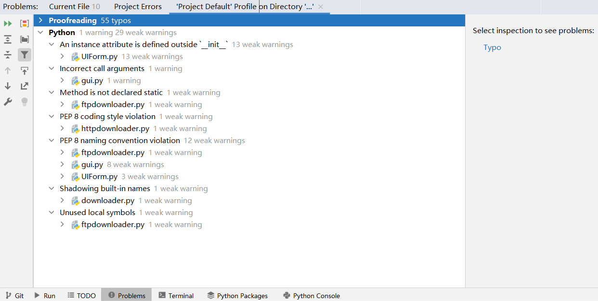
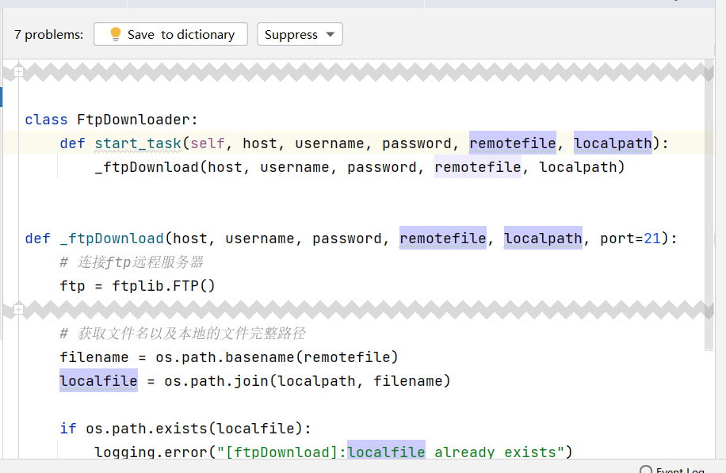
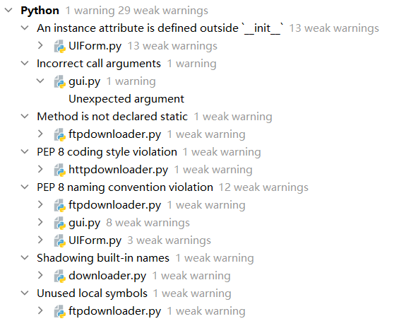
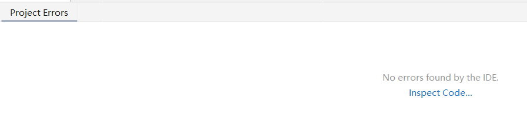

# 代码质量分析

使用pycharm的`Code Inspection`功能进行代码质量的审查与分析。



得到了代码审查的基本结果如上图所示。

## 拼写错误纠正

`Proofreading`是编码过程中的拼写错误，如下图例



可见`remotefile`和`localpath`在表义上清晰，但是却被代码审查工具标注为拼写错误，而相同语法性质的`filename`却没有报错 ，因此，对于该类错误，我的解决方案是将这些表义明确的变量名添加到代码审查工具的词典中。

即点击`Save to dictionary`进行用户词典的保存，这样就消除拼写方面的错误


## warnings以及weak warnings的消除



如上图，共有1个warning 和 29个weak warnings

依次定位和解决：

1. gui.py中在重写文件流的构造方法中直接通过`私有对象名 = 值`初始化了私有对象，引起了编译器的警告。

   解决方案为，重写了自定义文件流的构造函数，使其能够接受一个函数引用来初始化信号量

   ```python
   class MyOutputStream(QtCore.QObject):
       text_signal = QtCore.pyqtSignal(str)
   
       def __init__(self, func):
           super().__init__()
           self.text_signal.connect(func)
   
       def write(self, text):
           self.text_signal.emit(str(text))
   ```
   
   2. 部分注释和行间距不符合PEP8规范，使用pycharm的一键reformat解决了问题
   
   3. 有未使用的变量
   
      经排查是ftpdownloader中有一个try except块 命名的捕获异常未使用，将该异常在except块内打印后解决问题
   
   4. 命名覆盖
   
      由于给定需求中有input这一选项，和python标准库输入函数input重名，整个软件不使用标准库输入，因此无歧义
   
   5. 类内存在不访问成员方法和成员数据的方法
   
      按照python的规范，将其移至同文件类的外部
   
   6. Qt Designer自动生成的函数，与Qt库兼容但是PyCharm的Code Inspection会报weak warnings，这部分选择不修改
   
   这样就通过了所有的代码审查
   
   