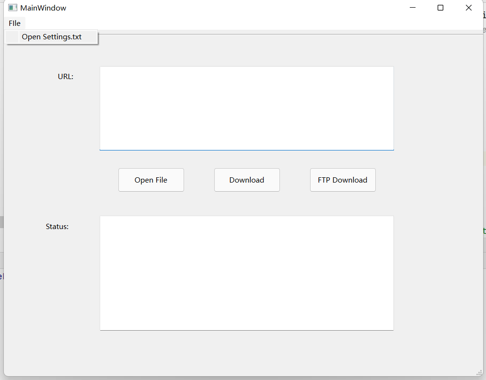
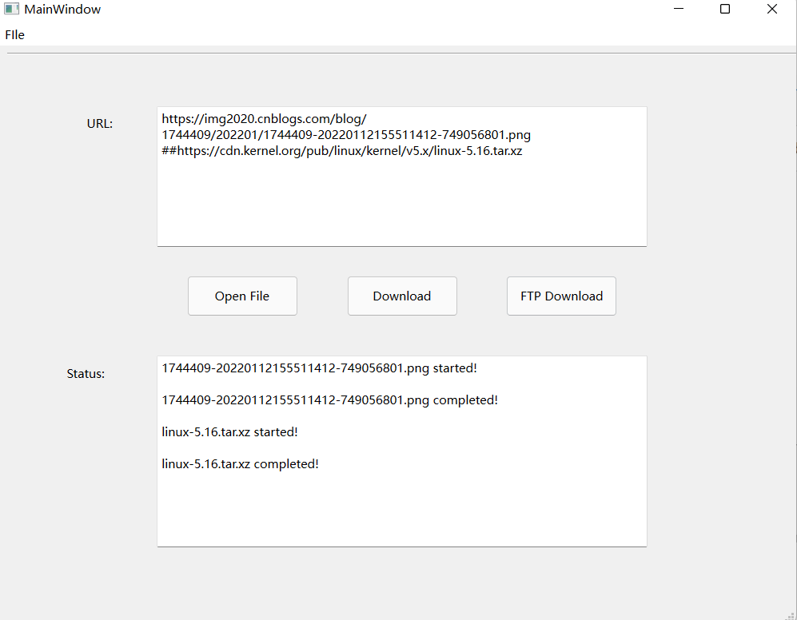

# 运行说明

## 一.命令行版本

### 环境要求

windows10+    

python 3.6+

依赖包

```
requests
tqdm
click
```

### 运行方法

将downloader.py，tinyftp.py与settings.txt置于同一目录下

在该目录下打开终端并输入

```shell
python downloader.py [options]
```

其中options的可选项为：

```shell
Usage: downloader.py [OPTIONS]

Options:
  -u, --url TEXT             URL to download
  -o, --output TEXT          Output filename
  -n, --concurrency INTEGER  Concurrency number (default: 8)
  -i, --input TEXT           filename with multiple URL
  --ftp TEXT                 ftpDownload:true,false[default]
  --help                     Show this message and exit.
```


## 二.GUI版本

### 环境要求

windows10+    

python 3.6+

依赖包

```
requests
tqdm
click
pyqt6
```

### 运行方法

将`downloader.py, tinyftp.py, settings.txt, UIForm.py gui.py`置于同一目录下

在该目录下打开终端并输入

```shell
python gui.py
```

即可打开软件界面



点击`OpenFile`按钮打开文件，url将自动加载到URL文本框，或直接在url框内输入待下载链接的url

点击download开始下载




在File菜单栏下的Open Settings选项可以