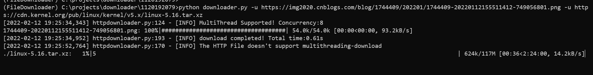
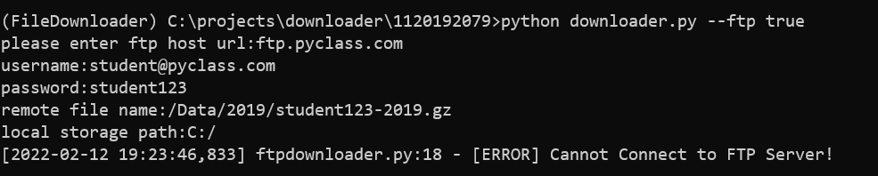
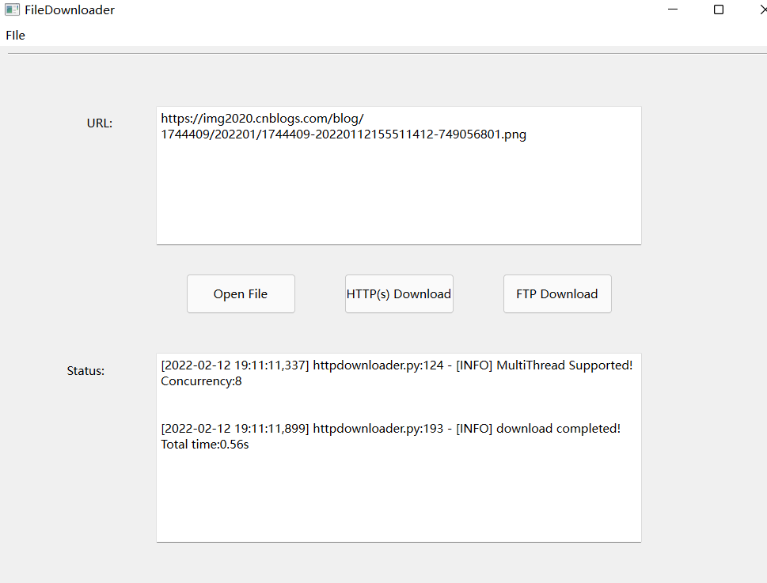

# 运行说明

执行入口有两个：

downloader.py脚本为命令行入口，gui.py为图形界面版本入口

在运行脚本前，请于根目录下运行：

```bash
pip install -r requirements.txt
```


可以通过修改settings.txt中的一些值来更改软件的默认配置，下图是settings.txt文件的默认配置

```
chunk_size 1024   # 多线程分块大小，单位：字节
logging.level INFO   # 输出日志级别(DEBUG-INFO-WARNING-ERROR)
concurrency 8   # 默认线程数大小
output ./   # 默认输出位置
template_language 0   # 正则表达式生成的最大字符串数量，为0表示不启用正则表达
```


## 一.命令行版本

### 环境要求

windows10+    

python 3.6+

依赖包

```
requests
tqdm
click
exrex
```

### 运行方法

将downloader.py，tinyftp.py与settings.txt置于同一目录下

在该目录下打开终端并输入

```shell
python downloader.py [options]
```

其中options的可选项为：

```shell
Usage: downloader.py [OPTIONS]

Options:
  -u, --url TEXT             URL to download
  -o, --output TEXT          Output filename
  -n, --concurrency INTEGER  Concurrency number (default: 8)
  -i, --input TEXT           filename with multiple URL
  --ftp TEXT                 ftpDownload:true,false[default]
  --help                     Show this message and exit.
```

特别注意的是，其中 -u参数可以反复多次指定不同的url，这些任务会依次开始多线程下载

批量url下载示例：

```
python downloader.py -u xxx.xxx.xxx/1.zip -u https://yyy.yyy.yyy/2.png -o ../../
```

界面如图所示：可以看到有进度条以及下载时间的提示



使用ftp下载功能时，使用如下的命令

```sehll
python downloader.py --ftp=true
```

终端会出现相应的提示：



依次输入信息之后就会开始尝试进行FTP下载

## 二.GUI版本

### 环境要求

windows10+    

python 3.6+

依赖包

```
requests
tqdm
click
exrex
pyqt6
```

### 运行方法

将`downloader.py, tinyftp.py, settings.txt, UIForm.py gui.py`置于同一目录下

在该目录下打开终端并输入

```shell
python gui.py
```

即可打开软件界面


点击`OpenFile`按钮打开文件，url将自动加载到URL文本框，或直接在url框内输入待下载链接的url，支持多行url

点击download开始下载


在File菜单栏下的Open Settings选项可以打开根目录下的设置文件`settings.txt`，并当文件关闭时，设置会自动更新到内存中

在第三阶段的最终版中，下载过程中，下方的文本显示控件能够打印经过重定向后的控制台日志

如下图所示

