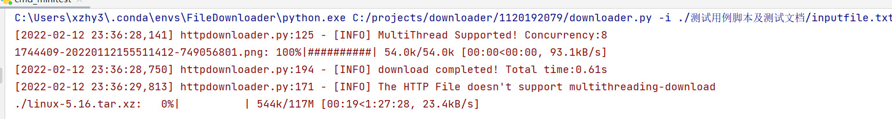
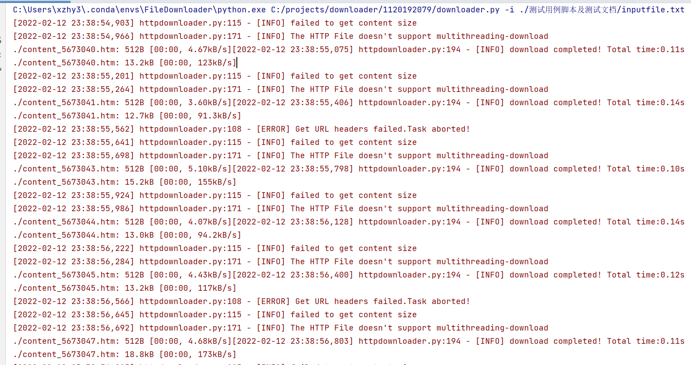
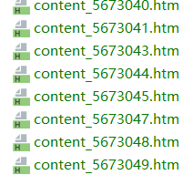

# 测试的基本工具和方法

日常的快速单元测试方法有2：

1. 同目录下我编写的批处理脚本，提供了三个简单的测试用例，覆盖了单线程，多线程，非正常url的情况，用于快速验证修改之后软件的主要功能不出现错误
2. PyCharm的测试工具链，用于完整的阶段性验收和集成测试中分析难以定位的bug


# 命令行版本测试

## 正确性测试：（有效等价类）

对于正确的url，是否能够成功下载

opus语料库中的一份语料（不支持多线程，很容易连接失败）

```
https://opus.nlpl.eu/download.php?f=ada83/v1/tmx/en-ru.tmx.gz
```

linux内核下载（不支持多线程）

```
https://cdn.kernel.org/pub/linux/kernel/v5.x/linux-5.16.tar.xz
```

随机的一张图片（支持多线程）

```
https://img2020.cnblogs.com/blog/1744409/202201/1744409-20220112155511412-749056801.png
```



测试结果正常

正则生成的文件（需于settings.txt指定template_language为大于0的整数）

```
http://www\.gov\.cn/xinwen/2022-02/11/content_567304[0-9]\.htm
```

共包含10个生成项



能够通过正则表达式下载



## 错误性测试

对于不正确的url，能否正确提示

```
https://img2sdfsfd020.cnblsfsdfogs.com/blog/1744409/202201/1744409-20220112155511412-749056801.png
```

对于任意的字符串，能够正确提示

```
adfkjhkj23423123
```


# GUI版本测试

由于GUI的下载功能调用与命令行版本相同，故采用Build Verification Testing，即对系统的基本功能进行简单的测试。这种测试强调程序的主要功能进行的验证，而不会对具体功能进行更深入的测试。


